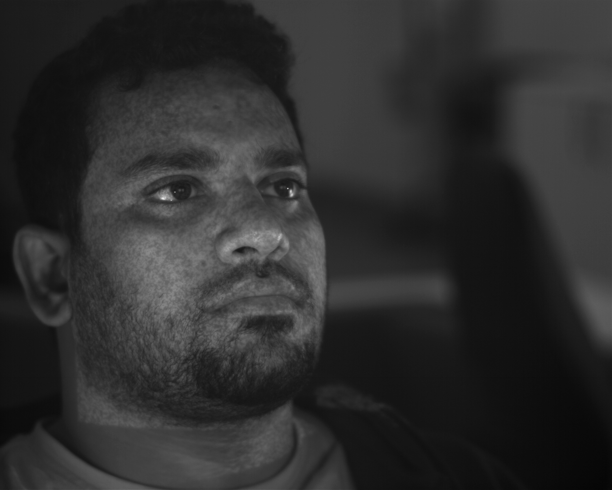
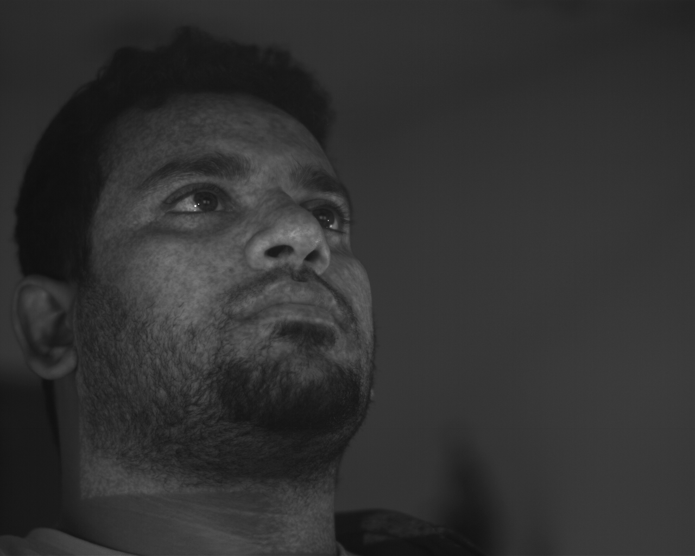
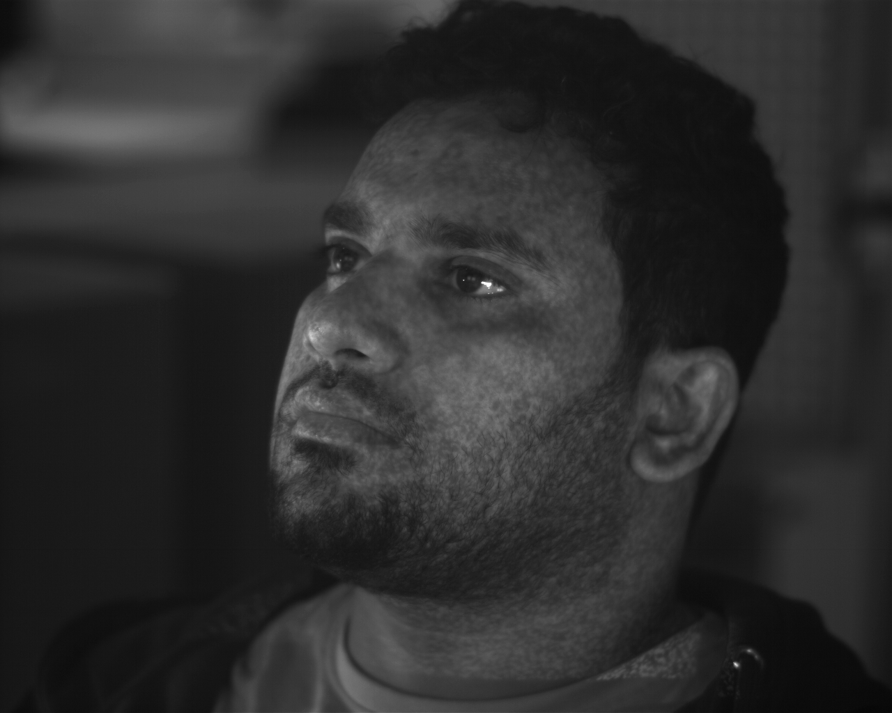
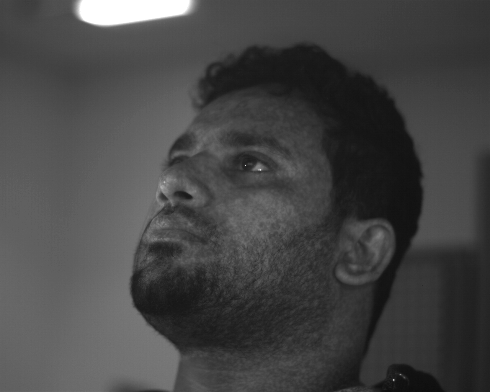
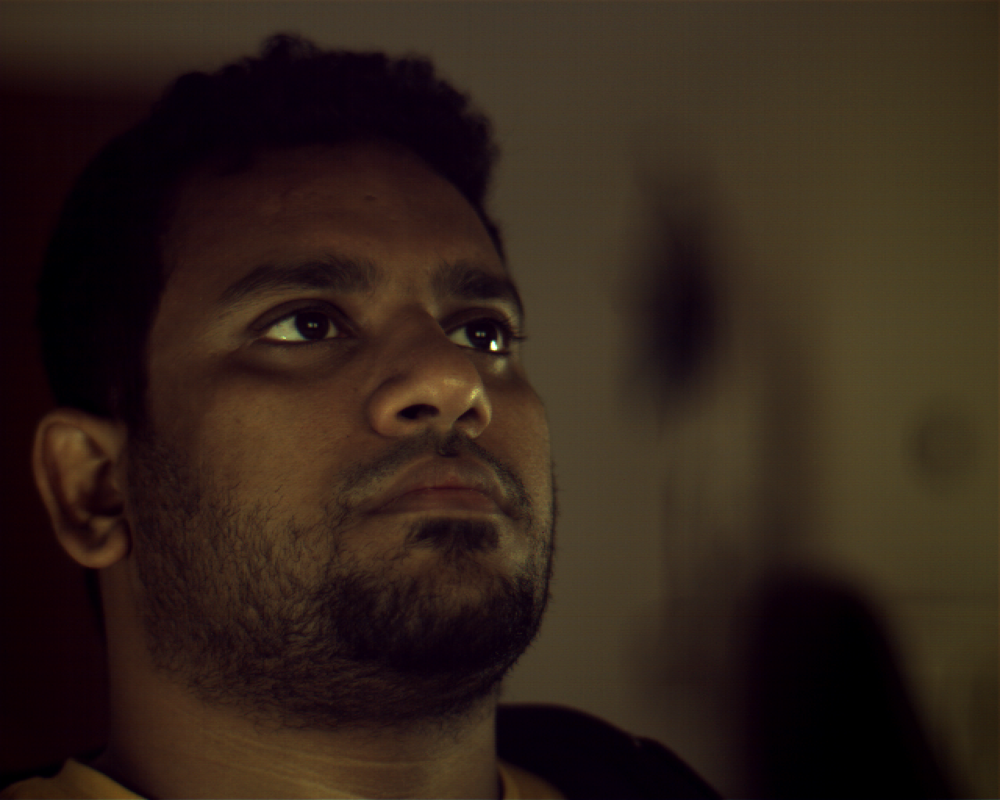
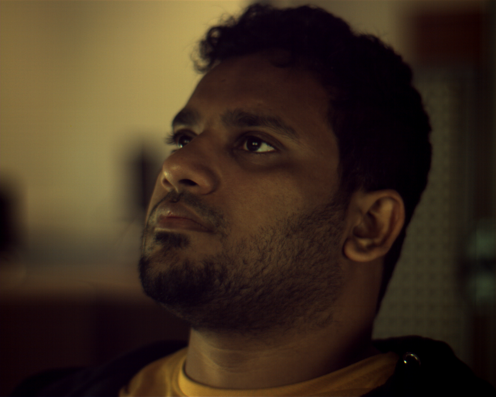
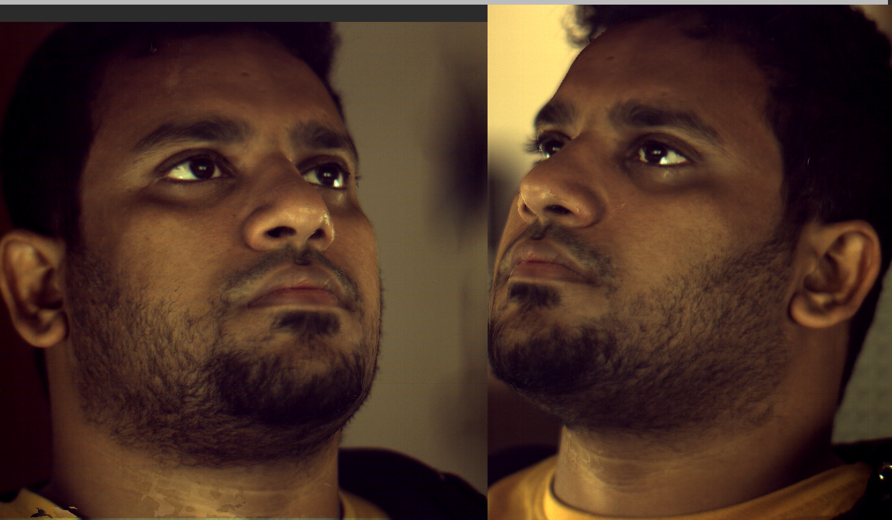

<p align="center">

</p>

# 3D Facial Reconstruction

A robust Python pipeline for processing stereo imaging data into textured 3D models using cross-platform executable integration.


## Overview

This project implements a complete 3D reconstruction pipeline that transforms stereo camera imagery into high-quality textured 3D models. The system processes synchronized stereo pairs from multiple camera systems (typically 1A/1B and 2A/2B for depth, plus 1C/2C for texture) to generate accurate 3D meshes with photorealistic texturing.

The pipeline integrates external reconstruction executables through a Python wrapper, providing automated batch processing, comprehensive error handling, and cross-platform compatibility. It's designed for research and production environments where reliable, repeatable 3D reconstruction from calibrated stereo systems is required.

This tool works in conjunction with [3dMD Mesh Projector](https://github.com/arvinsingh/3dmd-mesh-projector) to provide a complete stereo reconstruction and verification workflow.

Proprietary reconstruction executables are not included in this repository due to licensing restrictions. These binaries were developed as part of a professional project and cannot be opensourced at this time. However, opensourcing is planned for the future once permissions are secured.


## Quick Start

```bash
# Process single frame
python reconstruct.py --frame 0

# Process frame range  
python reconstruct.py --frame-range 0 5

# Process entire sequence with multithraeding
python reconstruct.py --sequence --parallel

# Process with custom directories and parallel processing
python reconstruct.py --sequence-dir test_data/sequence --output-dir results --frame-range 0 10 --parallel --workers 6

# Show system information
python reconstruct.py --info

# Verbose outpt (for debugging)
python reconstruct.py --frame 0 --verbose

# Custom configuration
python reconstruct.py --frame 0 --config custom_config.yaml
```

## Performance mode

See [multithreading.md](multithreading.md) for more detials.

## Installation

### Requirements
- Python 3.7+
- UV package manager
- Wine (Linux/Unix only)

### Setup
```bash
# Clone repository
git clone git@github.com:arvinsingh/3DFacialReconstruction.git
cd 3DFacialReconstruction

# Install Python dependencies
uv sync

# Linux/Unix only: Install Wine
sudo apt install wine  # Ubuntu/Debian
```

The system uses `config.yaml` for all configuration.

## Command Line Options

```
positional arguments:
  --frame FRAME              Process single frame number
  --frame-range START END    Process frame range (inclusive)

optional arguments:
  --sequence-dir DIR         Input sequence directory
  --output-dir DIR           Output directory  
  --base-dir DIR             Base directory for relative paths
  --config CONFIG            Configuration file path
  --verbose                  Enable verbose console output
  --info                     Show system information
  --help                     Show help message
  --parallel                 Enable parallel processing
  --mode MODE                Parallel processing mode (frame or pipeline)
  --workers N                Number of workers for parallel processing
```

## Input Data Structure

The system expects all files in a single sequence directory. This follows the same from [3dMD Mesh Projector](github.com/arvinsingh/3dmd-mesh-projector).

```
sequence/
├── calib_1A.tka               # Camera calibration files
├── calib_1B.tka               # (one per camera)
├── calib_2A.tka
├── calib_2B.tka
├── calib_1C.tka
├── calib_2C.tka
├── STEREO_1A_000.bmp          # Stereo camera images
├── STEREO_1B_000.bmp          # (cameras 1A, 1B, 2A, 2B)
├── STEREO_2A_000.bmp
├── STEREO_2B_000.bmp
├── TEXTURE_1C_000.bmp         # Texture camera images
└── TEXTURE_2C_000.bmp         # (cameras 1C, 2C)
```

System supports multiple image formats like `.bmp`, `.png`, `.jpg`, `.jpeg` (case-insensitive)

Flexible pattern matching supports various naming conventions:
- `STEREO_1A_000.bmp`, `stereo_1a_000.png` 
- `TEXTURE_1C_000.jpg`, `texture_2c_000.jpeg`
- `1A_000.bmp`, `2C_000.png`
- `cam1A_000.bmp`, `CAM2C_000.png`

## Visual Example

### Inputs

The system uses synchronized stereo pairs to compute depth information.

<div align="center">

<table>
<tr>
<td><br/><b>Camera 1A</b></td>
<td><br/><b>Camera 1B</b></td>
<td><br/><b>Camera 2A</b></td>
<td><br/><b>Camera 2B</b></td>
</tr>
</table>

High-resolution color cameras provide texture information.

<table>
<tr>
<td><br/><b>Texture Camera 1C</b></td>
<td><br/><b>Texture Camera 2C</b></td>
</tr>
</table>
</div>

### 3D Reconstruction Result
<div align="center">


<b>3D Mesh Animation</b>



<b>Generated Texture Map</b>

</div>

The pipeline combines stereo depth information with high-resolution texture data to produce photorealistic 3D models suitable for research, visualization, and further processing.

## Processing Pipeline

Each frame undergoes a 6-step processing pipeline:

1. **File Discovery**: Locate required images and calibration files
2. **Stereo Processing**: Generate 3D point cloud from stereo pairs
3. **Hole Filling**: Fill gaps in the mesh
4. **Surface Filtering**: Smooth mesh surface
5. **Texture Mapping**: Apply texture from color cameras
6. **Mesh Conversion**: Convert to standard OBJ format
7. **Cleanup**: Remove intermediate files

### Output Files

For each successfully processed frame following two files are created -

1. `frame_XXX.obj` -  Textured 3D mesh with UV coordinates
2. `frame_XXX.bmp` - High-resolution texture map

Files are named using frame numbers from input images (e.g., `STEREO_1*_005.bmp` → `frame_005.*`)

### Graceful Degradation
- Failed frames are skipped, processing continues
- Intermediate files are automatically cleaned up
- No impact on other frames in the sequence
- Clear reporting of what succeeded/failed

### Debug Mode

Enable verbose logging for troubleshooting:
```bash
python reconstruct.py --frame 0 --verbose
```

## Future Enhancements

1. **GPU Acceleration** Potential CUDA/OpenCL support for compute-intensive stages
2. **Distributed Processing** Network-based processing across multiple machines
3. **Adaptive Threading** Dynamic worker adjustment based on system load
4. **Memory Optimization** Streaming processing for very large sequences

## Acknowledgments

We gratefully acknowledge the participants who volunteered for the 3D facial data collection, whose contributions were essential to the success of this project.

Complete dataset used in the project is available at [Zenodo](https://doi.org/10.5281/zenodo.15397513).